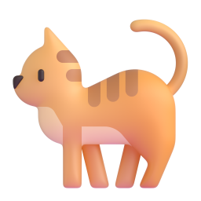

# CookieLab OS — 미니펫 + 뮤직플레이어 개편 요청서

작성일: 2026-07-03
상태: 요청 단계 (코드 미작성)
선행 문서: MULTI_WINDOW_PROPOSAL.md, WINDOW_SYSTEM_FOLLOWUP_PROPOSAL.md, DESIGN_REFRESH_PROPOSAL.md
대상: 이 문서를 보고 구현할 개발자 / Codex 등 병행 작업 도구

---

## 0. 두 요청을 관통하는 공통 아키텍처 원칙 — "렌더 루트 밖 영속 레이어"

현재 구조의 근본 제약: `render()`(`src/app.js:1859-1868`)가 `root.innerHTML`을
통째로 교체하므로, **렌더 루트(`#app`) 안에 있는 모든 DOM은 상태 변경 때마다
파괴/재생성된다.** 오디오가 끊기는 원인이자, 미니펫 애니메이션을 렌더 루트 안에
두면 안 되는 이유다.

**해결 패턴 (두 요청 모두 동일하게 적용):**

```
document.body
├── #app                ← render()가 innerHTML로 통째로 교체 (기존)
├── #persistent-audio   ← 신규: JS로 1회 생성, 이후 절대 재생성 안 함
└── #desktop-pet        ← 신규: JS로 1회 생성, rAF/CSS로만 애니메이션
```

- 영속 레이어는 부트 시 `document.createElement`로 1회 생성해 `document.body`에
  append. `render()`와 완전히 분리 — state가 바뀌어도 DOM이 살아남는다.
- UI(창, 독)는 기존 방식대로 state를 반영해 렌더링하되, 실제 재생/애니메이션은
  영속 레이어의 엘리먼트를 **명령형으로** 제어한다 (이미 `setMusicVolume`이
  `src/app.js:819-828`에서 쓰는 패턴의 확장).

---

## 요청 A. 미니펫 (데스크탑 펫)

### A-1. 개요

화면 우측 하단 영역을 자율적으로 돌아다니는 작은 캐릭터. 꾸미기 요소이며
기능 버튼이 아니다. 클릭하면 반응하고, 평소에는 걷기/앉기/잠자기를 반복한다.

### A-2. 에셋

새 디자인 언어(DESIGN_REFRESH_PROPOSAL.md, 밝은 글래스 + Fluent Emoji 3D)와
일관되게 **Fluent Emoji 3D 이미지 1~2장 + CSS 트랜스폼 애니메이션** 조합을 권장.
스프라이트 시트 제작 불필요.

- 기본 캐릭터: `Cat face` 또는 `Dog face` 계열 대신 몸통이 있는
  `Cat`(`assets/Cat/3D/cat_3d.png`) 권장. 대안: `Hamster`, `Penguin`.
- 다운로드: `https://raw.githubusercontent.com/microsoft/fluentui-emoji/main/assets/Cat/3D/cat_3d.png`
  → `assets/pet/cat_3d.png` 로컬 저장 (MIT 라이선스).
- 잠자기 상태용 `Zzz`(`assets/Zzz/3D/zzz_3d.png`)를 펫 위에 작게 겹쳐 표시 (선택).
- 애니메이션은 이미지 교체가 아니라 CSS로 표현:
  - 걷기: `transform: translateX(...)` 이동 + 위아래 4px 바운스 keyframe
  - 방향 전환: `scaleX(-1)` 좌우 반전
  - 앉기/대기: 바운스 정지, 2~3초마다 살짝 기울기(`rotate(±3deg)`)
  - 잠자기: `opacity 0.85` + 느린 숨쉬기 스케일(`scale(1)↔scale(1.03)`)
  - 클릭 반응: 점프(`translateY(-16px)`) + 하트/별 이모지 파티클 1개 팝

### A-3. DOM / 상태

렌더 루트 밖 영속 레이어로 구현 (§0). `render()`와 무관하게 동작.

```html
<div id="desktop-pet" class="desktop-pet" aria-hidden="true">
  
</div>
```

```js
const petState = {
  enabled: true,          // localStorage "cookielab-os-pet" 에 저장
  x: 0, y: 0,             // 현재 위치 (px, 화면 좌표)
  targetX: 0, targetY: 0, // 이동 목표 지점
  facing: 1,              // 1 = 오른쪽, -1 = 왼쪽
  mode: "idle",           // "idle" | "walk" | "sit" | "sleep" | "react"
  modeUntil: 0,           // 현재 모드 유지 시한 (timestamp)
};
```

### A-4. 행동 로직 (상태 머신)

- **활동 영역**: 화면 우측 하단 사분면 — `x: 뷰포트 너비의 55%~ (우측 여백 24px)`,
  `y: 뷰포트 높이의 60% ~ (taskbar/독 상단 - 펫 높이)`. 독/taskbar와 겹치지 않게
  하단 경계는 독 top에서 8px 위. 창(window-panel)과의 충돌 판정은 하지 않는다
  (펫이 창 위를 걸어도 무방 — 단 z-index는 창보다 낮게, §A-5).
- **모드 전환 (idle 루프)**: 매 tick(아래 rAF 루프)에서 `modeUntil` 경과 시 랜덤 전환:
  - `idle`(2~5초) → 60% 확률 `walk`, 25% `sit`, 15% `sleep`
  - `walk`: 활동 영역 내 랜덤 목표점 선택, 40~60px/초 속도로 이동. 도착 시 `idle`.
  - `sit`(4~8초) → `idle`
  - `sleep`(8~15초) → `idle` (클릭하면 즉시 깨어남 → `react`)
  - `react`(0.8초, 클릭 시): 점프 애니메이션 후 `idle`
- **이동 구현**: `requestAnimationFrame` 루프 1개에서 `petState.x/y`를 보간하고
  `element.style.transform = translate(x, y) scaleX(facing)` 만 갱신.
  **`render()` 호출 절대 금지, layout 속성(left/top) 대신 transform 사용.**
- **탭 비활성화 대응**: `document.visibilitychange`에서 hidden 시 rAF 루프 정지,
  visible 시 재개 (백그라운드 CPU 낭비 방지).
- **창 리사이즈 대응**: `resize` 시 활동 영역 재계산, 펫이 영역 밖이면 가장
  가까운 경계 안쪽으로 클램프.

### A-5. z-index / 레이어링

- 펫은 `position: fixed`, z-index는 **창(window-panel)보다 낮고 데스크탑
  아이콘보다 높게**. 현재 창 z-index가 `state.nextZIndex` 증가 방식이므로,
  펫은 고정값(예: `z-index: 5`)으로 두고 창 기본 z-index 시작값이 이보다 크도록
  확인. 독/taskbar/시작 메뉴보다도 아래.
- `pointer-events: auto`는 펫 이미지 자체에만 — 활동 영역 전체를 덮는 투명
  레이어를 만들면 안 됨 (아래 UI 클릭을 가로챈다).

### A-6. 설정 연동 / 접근성

- System Folder 설정 창에 "데스크탑 펫" on/off 토글 추가
  (`data-action="toggle-desktop-pet"`). off 시 `#desktop-pet`에 `hidden` 적용 +
  rAF 루프 정지. 설정은 `localStorage("cookielab-os-pet")`에 저장.
- 펫은 순수 장식이므로 컨테이너에 `aria-hidden="true"` 유지. 클릭 반응은 보너스
  기능이라 키보드 접근 경로 불필요 — 단, **펫 때문에 다른 UI의 키보드/포커스
  동작이 방해되면 안 됨** (tabindex 부여 금지).
- `prefers-reduced-motion: reduce` 시: 걷기/바운스 정지, 펫은 고정 위치에 앉은
  상태로만 표시 (또는 설정 기본값 off).

---

## 요청 B. 뮤직플레이어 구조 개편

### B-1. 현재 구조와 문제 진단

- `<audio class="local-audio-player">`가 `LocalAudioDockPlayer()`
  (`src/app.js:1740-1789`) 내부에 문자열 템플릿으로 렌더링됨 →
  **모든 `render()` 호출 시 오디오 엘리먼트가 파괴/재생성되어 재생이 끊긴다.**
  음악 관련 액션 경로만 `playLocalAudioElement()`(`src/app.js:756-770`)로 재생을
  복구하기 때문에, 창 열기/드래그 커밋/설정 변경 등 **음악과 무관한 상태 변경이
  일어나면 재생이 멈춘 채로 남는다.** ("창을 열어둬야만 재생됨" 증상의 원인)
- 로컬 트랙 목록 데이터는 이미 존재 (`localAudioTracks`, `src/app.js:74-110`,
  5곡). Music Player 창 설정 섹션(`src/app.js:1372-1394`)에 목록 UI도 일부 있으나
  "라이브러리 설정"으로 묻혀 있어 눈에 띄지 않는다.
- 신스 엔진(Web Audio, `startMusic`/`scheduleMusicStep`)은 이번 요청 범위에서
  **유지하되 변경 없음** — 로컬 오디오 경로만 개편.

### B-2. 목표

1. 재생은 창/독/렌더링과 완전히 독립 — 음악을 켜두면 창을 닫아도, 어떤 조작을
   해도 끊기지 않는다.
2. Music Player 창에서 음원 목록이 바로 보이고, 목록에서 곡을 클릭하면 재생된다.
3. 기존 하단 미니 독 플레이어는 유지 (재생 중 표시/제어용).

### B-3. 영속 오디오 컨트롤러 (§0 패턴 적용)

`<audio>`를 문자열 템플릿에서 제거하고, 부트 시 1회 생성하는 컨트롤러 모듈로 교체:

```js
const audioController = (() => {
  const element = document.createElement("audio");
  element.preload = "metadata";
  element.loop = true;
  element.style.display = "none";
  document.body.appendChild(element);   // #app 밖 — render()에서 절대 안 죽음

  return {
    element,
    load(track)   { if (element.src !== new URL(track.src, location.href).href) { element.src = track.src; } },
    play()        { return element.play(); },
    pause()       { element.pause(); },
    setVolume(v)  { element.volume = v; },
    get currentTime() { return element.currentTime; },
    get duration()    { return element.duration; },
  };
})();
```

- 기존 `document.querySelector(".local-audio-player")` 참조 4곳
  (`src/app.js:752, 758, 819` 등)을 모두 `audioController`로 교체.
- `LocalAudioDockPlayer()` 템플릿에서 `<audio>` 태그 제거 (`src/app.js:1780-1786`).
- `loop`는 "한 곡 반복"이 아니라 **트랙 종료 시 다음 곡 자동 재생**으로 변경 권장:
  `element.loop = false` + `element.addEventListener("ended", nextLocalAudioTrack)`.
  (전체 목록 순환 = 플레이리스트 동작. 한 곡 반복은 반복 모드 토글로 제공, 선택.)
- 자동재생 정책 대응: 첫 재생은 반드시 사용자 제스처(클릭) 경로에서만 시작
  (현재도 그렇게 되어 있음 — 유지). `play()` 실패 시 현재처럼 상태 롤백.

### B-4. Music Player 창 개편 — 음원 목록 중심 레이아웃

`MusicPlayerWindow` 레이아웃을 아래 구조로 재구성 (신스 섹션은 접거나 하단 배치):

```
┌─ Music Player ──────────────────────────┐
│ [앨범아트 자리(아이콘)] 곡명              │
│  아티스트 · 라이선스                      │
│  ◀◀   ▶/Ⅱ   ▶▶      ──────●──  1:24/3:05 │  ← 트랜스포트 + 진행 바
│  volume ──────●──                        │
├─ Tracks (5) ────────────────────────────┤
│ ▶ BLACK BOX - South Korea    3:05       │  ← 재생 중 곡 하이라이트
│   CookieLab Loop             0:42       │
│   Water Afro Pop Music       2:58       │
│   No Copyright Music         3:21       │
│   빛의 세상으로 (소향)        4:02       │
├─────────────────────────────────────────┤
│ ▸ Synth sequencer (기존 신스 UI, 접힘)    │
└─────────────────────────────────────────┘
```

- **트랙 목록**: `localAudioTracks` 전체를 항상 표시. 각 행은
  `<button data-action="play-local-audio-track" data-track-id="...">` —
  클릭 즉시 해당 곡 로드+재생 (`selectLocalAudioTrack` 재사용, 단 항상 재생 시작
  하도록 옵션 추가). 재생 중인 곡 행에 `is-playing` 클래스 + ▶ 인디케이터 +
  `aria-current="true"`.
- **진행 바**: `<input type="range">` 시킹 지원. 진행 표시는 `timeupdate`
  이벤트에서 **직접 DOM 갱신** (`render()` 호출 금지 — 초당 4회 이벤트로 전체
  리렌더 하면 안 됨. `setMusicVolume`의 라벨 직접 갱신 패턴과 동일하게).
  창이 닫혀 있으면 해당 DOM이 없으므로 querySelector null 체크 후 무시.
- **곡 길이 표시**: `loadedmetadata` 시점에 duration을 읽어 상태에 캐시
  (`state.music.trackDurations[trackId]`). 최초에는 "—:—" 표시.
- 창을 닫아도 `audioController`는 살아있으므로 재생 지속. 창을 다시 열면
  state 기반으로 현재 곡/재생 상태가 그대로 표시된다.

### B-5. 하단 미니 독 플레이어 (기존 유지 + 소폭 보강)

- `LocalAudioDockPlayer()`에서 `<audio>` 태그만 제거하고 UI는 유지.
- 곡명 클릭 시 Music Player 창 열기(`openWindow("app-detail", { appId: "music-player" })`
  — 실제 kind/appId는 기존 `openWindow` 호출부와 동일하게).
- "PLAYING/READY" 텍스트를 곡 진행 시간(`1:24 / 3:05`)으로 교체 (timeupdate
  직접 갱신, §B-4와 동일 패턴).
- 재생 중이 아닐 때 독 플레이어를 숨길지 여부는 현재 동작 유지 (항상 표시).

### B-6. 상태/저장 변경 요약

- `state.music`에 추가: `trackDurations: {}` (세션 캐시, localStorage 저장 불필요).
- `localStorage("cookielab-os-music")` 스키마 변경 없음 (기존 필드 그대로).
- `state.music.localPlaying`은 계속 단일 진실 소스 — audioController의
  `play/pause` 이벤트에 리스너를 달아 외부 요인(재생 실패 등)으로 상태가
  어긋나면 state를 동기화.

---

## C. 구현 순서 제안

1. **B-3 영속 오디오 컨트롤러** — 가장 근본적인 개선. 이것만으로 "재생 끊김"
   문제 해결. (기존 UI 그대로 두고 오디오만 이전 → 동작 확인 용이)
2. **B-4 Music Player 창 개편** — 트랙 목록 + 진행 바.
3. **B-5 미니 독 보강**.
4. **A 미니펫** — 독립 기능이므로 B와 병행 가능. A-3 DOM/상태 → A-4 행동 루프 →
   A-2 애니메이션 → A-6 설정/접근성 순.
5. 통합 확인: 음악 재생 중 창 열기/닫기/드래그/최소화를 반복해도 재생이 끊기지
   않는지, 펫이 움직이는 동안 창 드래그 프레임이 떨어지지 않는지.

## D. 수용 기준 (완료 판정)

- [ ] 음악 재생 중 Music Player 창을 닫아도 재생이 계속된다.
- [ ] 음악 재생 중 다른 창 열기/드래그/설정 변경을 해도 재생이 끊기지 않는다.
- [ ] Music Player 창에 5곡 목록이 보이고, 곡 클릭으로 즉시 재생된다.
- [ ] 재생 중 곡이 목록에서 시각적으로 구분된다 (+ `aria-current`).
- [ ] 곡이 끝나면 다음 곡이 자동 재생된다.
- [ ] 진행 바 시킹이 동작하고, 진행 표시가 전체 리렌더 없이 갱신된다.
- [ ] 펫이 우측 하단 영역에서 걷기/앉기/잠자기를 반복하고 클릭에 반응한다.
- [ ] 펫이 창/독/아이콘의 클릭·키보드 조작을 방해하지 않는다.
- [ ] 설정에서 펫 on/off 가능, 새로고침 후에도 유지된다.
- [ ] `prefers-reduced-motion` 시 펫 이동 애니메이션이 정지된다.
- [ ] 백그라운드 탭에서 펫 rAF 루프가 정지된다 (CPU 확인).

## E. 범위 밖

- 신스 시퀀서(Web Audio) 로직 변경 — 그대로 유지
- 음원 파일 추가/교체 (기존 `assets/audio/` 5곡 그대로)
- 펫 다중 마리 / 펫 종류 선택 UI (v2 후보)
- 펫과 창의 물리적 상호작용 (창 위에 올라타기 등 — v2 후보)
- 미디어 세션 API(`navigator.mediaSession`) 연동 — 선택 구현 (하면 좋음:
  OS 미디어 키로 재생/일시정지/다음 곡 제어 가능)

## F. 참고 — 코드 위치 인덱스

- `src/app.js:74-110` — `localAudioTracks` (5곡 데이터)
- `src/app.js:125-131` — `defaultMusic` 상태
- `src/app.js:724-749` — `startMusic`/`stopMusic` (신스, 변경 없음)
- `src/app.js:751-770` — `pauseLocalAudioElement`/`playLocalAudioElement` (교체 대상)
- `src/app.js:805-829` — `setMusicVolume` (직접 DOM 갱신 패턴 참고)
- `src/app.js:852-909` — 로컬 트랙 선택/토글 (audioController로 연결 교체)
- `src/app.js:1372-1394` — 현재 창 내 트랙 목록 UI (B-4로 개편)
- `src/app.js:1740-1789` — `LocalAudioDockPlayer()` (`<audio>` 태그 제거 대상)
- `src/app.js:1859-1868` — `render()` (innerHTML 전체 교체 — 영속 레이어 분리 근거)
- `src/app.js:2281+` — 클릭 위임 핸들러의 음악 액션 분기 (새 액션 추가 지점)
